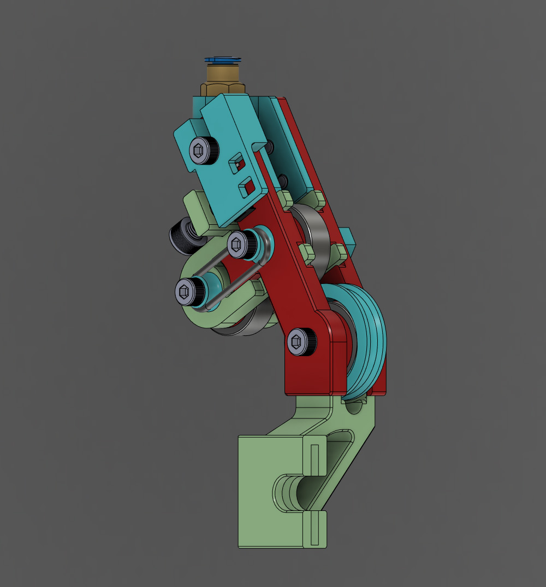
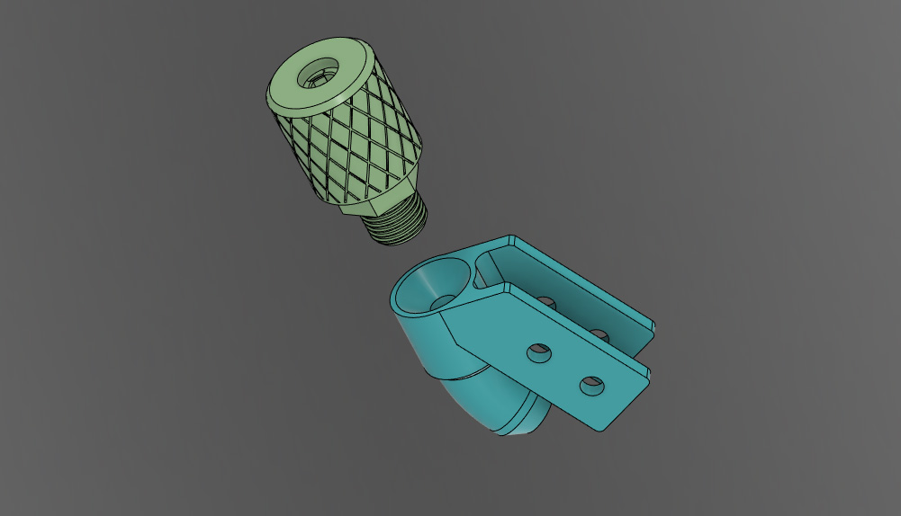

# Ender 3 Runout Sensor Mech

### Parts
* 2 - M4 x 30 screws
* 2 - M4 x 6 screws
* 1 - M4 x 16 screw
* 1 - M5 x 8 screw
* 3 x 608 skateboard bearings.
* 1 x Microswitch
* Whichever wire and connectors you need to connect the microswitch to your controller board.

### Optional Parts
* M10 Pneumatic coupler if you use a section of PTFE tube for the filament guide.
* PTFE (bowden) tube.

STL/STEP files for a printable coupler and a guide that can be used instead of the threaded coupler mount are included.

---
The switch I used came out of a computer mouse. It should be fairly simple to make a housing to fit other types of switches.

The coupler used is the kind that goes in the hotend. This size will let the TPFE tubing pass through. If you don't have one you can print the included coupler STLs. Alternatively, there is a simple guide that doesn't use a piece of tubing.

This design uses a modified [Ender 3 Filament Roller Guide](https://www.thingiverse.com/thing:3052488) to mount to the printer.

Everything can be printed without supports.

---

Extras
---

