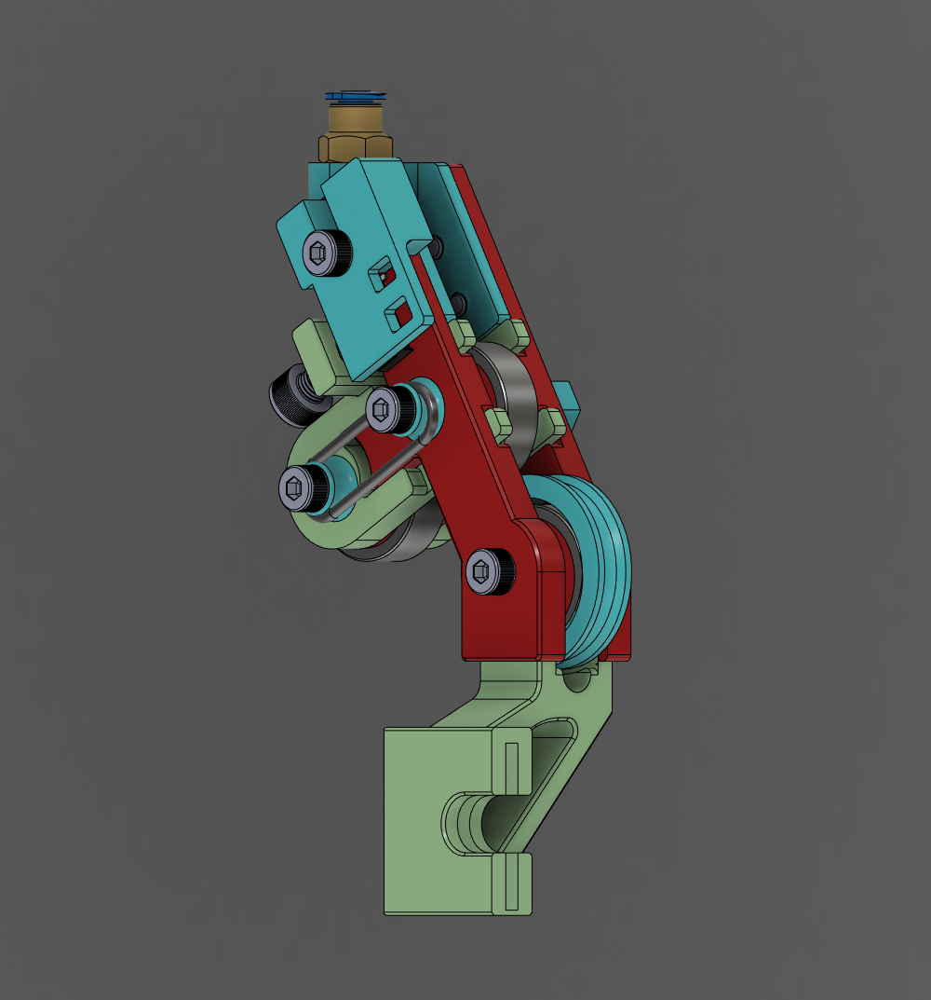

# Ender 3 Runout Sensor Mech

### Parts
* 2 - M4 x 30 screws
* 2 - M4 x 6 screws
* 1 - M4 x 16 screw1
* 1 - M5 x 5-8 screws

Screw lengths are not critical. Print spacers if yoou have some that are a bit too long.

* 3 x 608 skateboard bearings.
* 1 x Microswitch
* Whatever wire and connectors you need to connect the microswitch to your controller board.

### Optional Parts
* M10 Pneumatic coupler if you use a section of PTFE tube for the filament guide.
* PTFE (bowden) tube.

---
The switch I used came out of a computer mouse. It could be fairly simple to make a housing to fit other types of switches.

The coupler used is the kind that goes in the hotend. This size will let the TPFE tubing pass through. If you don't have one you can print this one [link](https://www.thingiverse.com/thing:1993384), but you'll need to drill or melt the hole so the tubing can pass through.

Alternately, there is a simple guide that doesn't use a piece of tubing.

This design uses a modified [Ender 3 Filament Roller Guide](https://www.thingiverse.com/thing:3052488) to mount to the printer.

Everything can be printed without supports. The switch housing mounting holes have a 0.2 mm layer blocking the holes. This allows for bridging when printing. The holes can be easily cleared after printing using something pointy.

---

